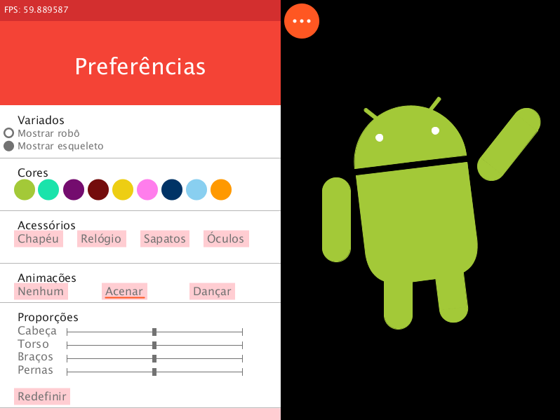

Processing Sketches
===================

Most of these Processing sketches were made back in 2015, when I was into
a CG class. Everything here that has no copyright should be good for you to
look at and inspire at, as long as you respect the license.

I do not promise that everything here will work, since it was made back in
Processing 2.x. I suppose simpler sketches will.

I also do won't promise you it won't lag. If you have a weak PC, it probably
will.

tp01\_androidify
----------------

An Android robot, with animation, customization, etc.
Also contains some sort of rigging for animations.
Needless to say the robot itself is NOT my intelectual property, so its appearance
is not subject to this repo's license.

tp04\_nagai
-----------
Some sort of small, smart thingy. Supposed to look like some sort of
smart mirror with weather and etc.
Uses your webcam and OpenCV (using opencv\_processing library and YahooWeather library).
Will not work on Processing 3.x and up, since I also use pure Java and a Runnable
applet extension. I don't think I'll ever update this code, but it's there.

